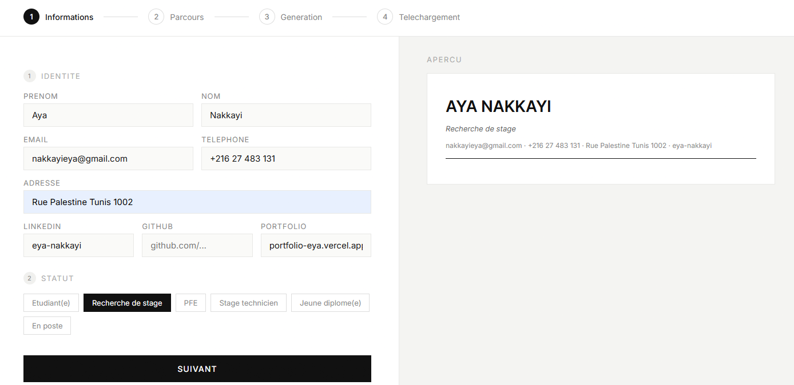
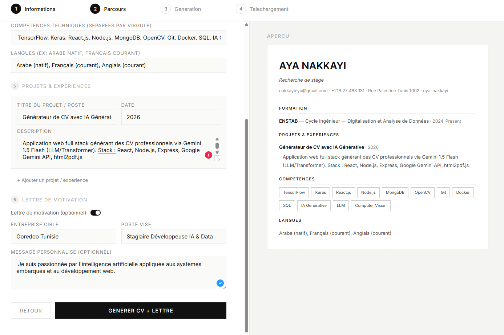
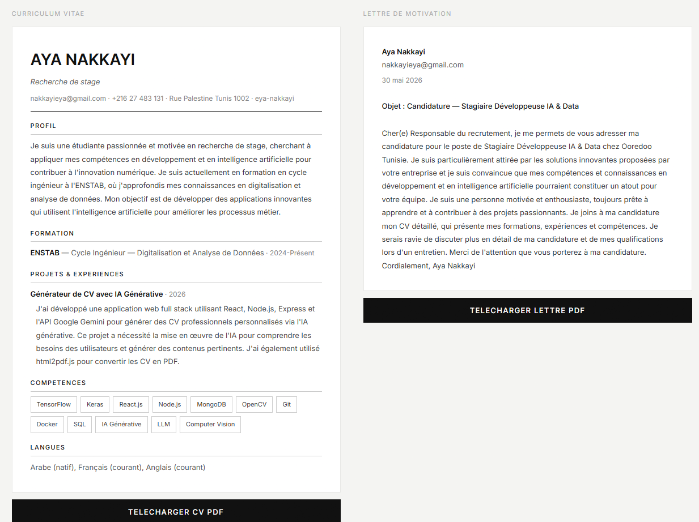

# CV.gen — Générateur de CV avec IA Générative

Application web de génération automatique de CV et lettres de motivation propulsée par Llama 3.3 70B via Groq (LLM/Transformer).

## Démo vidéo
[Cliquez ici pour voir la démo](https://drive.google.com/file/d/1c9qRNPhFS8uY7VJmLWKg3CdkR41BQi2s/view?usp=sharing)

## Captures d'écran

### Landing page


### Formulaire — Informations


### Formulaire — Parcours


### CV et Lettre générés


## Modèle génératif utilisé
- **Llama 3.3 70B** via Groq API — LLM / Transformer
- Génère : profil professionnel, amélioration des descriptions de projets, lettre de motivation personnalisée complète

## Fonctionnalités
- Landing page minimaliste
- Formulaire intelligent en 2 étapes (Informations + Parcours)
- Preview CV en temps réel
- Génération du contenu par IA (Llama 3.3 70B)
- Lettre de motivation optionnelle
- Export PDF CV et Lettre séparément en un clic

## Stack technique
- Frontend : React + Vite
- Backend : Node.js + Express
- IA : Groq API — Llama 3.3 70B (LLM / Transformer)
- PDF : html2pdf.js

## Lancer le projet en local

### Backend
```
cd backend
npm install
node index.js
```

### Frontend
```
cd frontend
npm install
npm run dev
```

Ouvrir http://localhost:5173

## Variables d'environnement
Créer `backend/.env` :
```
GROQ_API_KEY=ta_clé_groq
PORT=3001
```

## Étudiante
- Nakkayi Aya — ENSTAB, Cycle Ingénieur, Digitalisation et Analyse de Données

## Cours
IA Générative — Mme Amira Echtioui — 2025/2026
